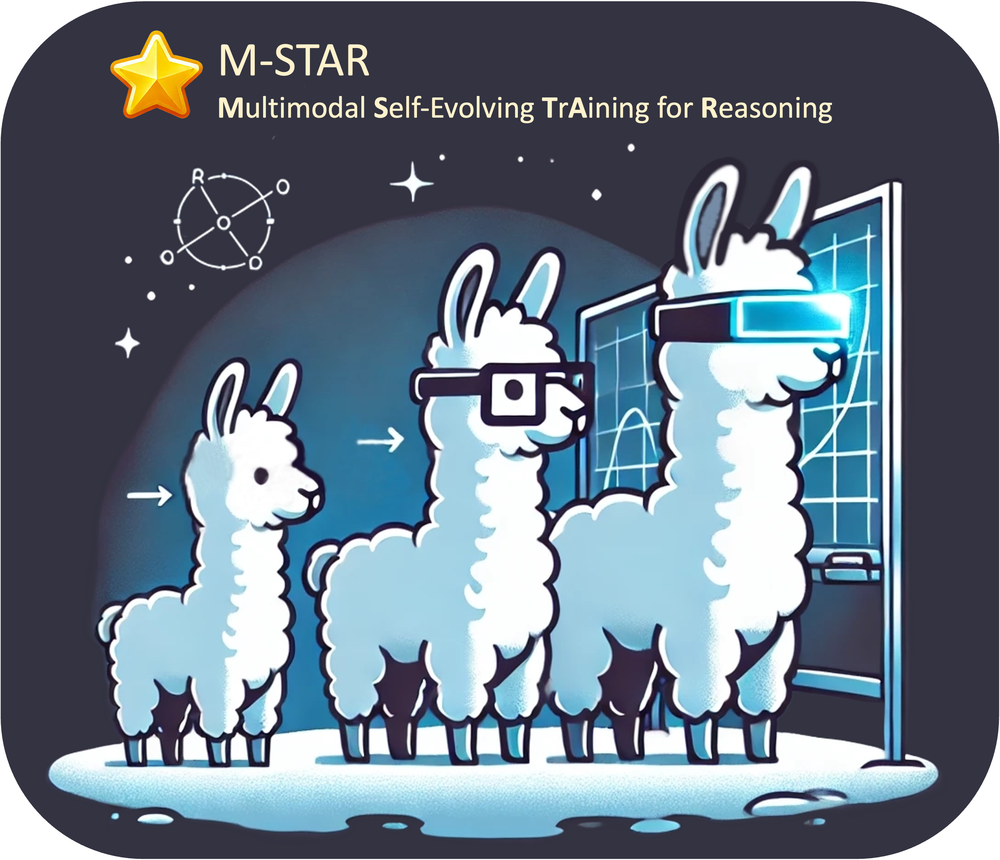
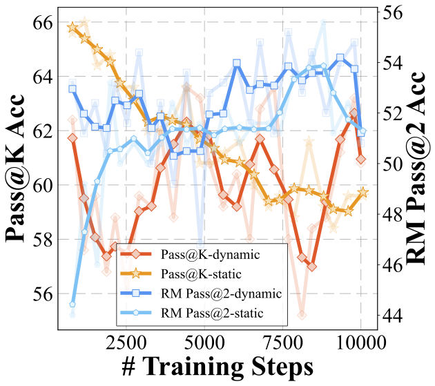

# M-STAR

<p align="center">
  
</p>

<p align="center">
  :star: <a href="https://mstar-lmm.github.io/">Project Page</a>&nbsp;&nbsp;&nbsp;
</p>

<p align="center">
  :hugs: <a href="https://huggingface.co/collections/hkust-nlp/m-star-676bbf9f749dbf511e7c4a32">HF Repo</a>&nbsp;&nbsp;&nbsp;
  :page_with_curl: <a href="https://arxiv.org/abs/2412.17451">Paper</a>
</p>

Welcome to M-STAR (**M**ultimodal **S**elf-Evolving **T**r**A**ining for **R**easoning) Project! 

This is the **preview version** of M-STAR. We will continue to update, please stay tuned!

## What is M-STAR :star:?
M-STAR is a framework to improve the **Multimodal Reasoning** ability of Large Multimodal Models (LMMs) via **Self-Evolving Training**.

Unlike traditional **Self-Evolving Training**, M-STAR supports **Large Multimodal Models**, **Training with Multimodal Process Reward Models (MPRM)**, and **Adaptive Explorations during Training**.

M-STAR includes:

- **M-STAR Framework**: A framework for Self-Evolving Training of LMMs including **Generation**, **Training**, and **Rewarding**. With M-STAR, we can:
  - Efficiently generate diverse responses for a given query using [lmdeploy](https://github.com/InternLM/lmdeploy)
  - Generate data to train Multimodal Process Reward Models (MPRM)
  - Train MPRM to assess multimodal reasoning
  - Perform **Self-Evolving Training** of LMMs to enhance multimodal reasoning ability
  - Monitor training dynamics and adaptively adjust exploration (e.g., temperature) during training

- **M-STAR Resources**:

    | **Component**                |**Description**                                                                                                     |
    |------------------------------|---------------------------------------------------------------------------------------------------------------------|
    | **M-STAR Model**              | A strong LMM for multimodal reasoning, scoring **59.5** on MathVista, based on [MiniCPM-V-2.5](https://github.com/OpenBMB/MiniCPM-V) with 8B parameters. |
    | **M-STAR PRM**                | A Multimodal Process Reward Model (MPRM) that evaluates the quality of multimodal reasoning data at the step level.  |
    | **M-STAR CoT Dataset**        | A collection of 100K generated multimodal reasoning data with CoT, where the queries are sourced from [MathV360K](https://huggingface.co/datasets/Zhiqiang007/MathV360K).                      |
    | **M-STAR MPRM Training Dataset** | A set of 50K multimodal reasoning data designed for training MPRM.                                             |

## News

- :fire: [12/2024] We are excited to release the preview version of M-STAR! In this release, all **M-STAR Resources** are available, and the components for **Generation** and **Training of MPRM** are coming soon. To enhance the user experience, we are currently refining the code for the entire **M-STAR Framework**, which will be available after the release of **Generation** and **Training of MPRM**!

## Performance

### Main Results

<div align="center">

|                            | MathVista | FQA   | GPS   | MWP   | TQA   | VQA   |
|----------------------------|-----------|-------|-------|-------|-------|-------|
| **Baselines**              |           |       |       |       |       |       |
| MiniCPM-V-2.5              | 52.4      | 59.2  | 44.7  | 50.5  | 53.8  | 48.0  |
| &nbsp;&nbsp;&nbsp;+ warmup | 52.6      | 58.4  | 47.1  | 57.0  | 53.8  | 45.8  |
| SFT                        | 54.8      | 58.7  | 50.5  | 56.5  | 55.7  | 50.8  |
| ReST<sup>EM</sup>          | 55.1      | 59.1  | 49.5  | 65.6  | 55.1  | 48.0  |
| Iterative RFT              | 55.7      | 59.1  | 49.5  | 64.5  | 55.1  | 47.5  |
| **Static components only** |           |       |       |       |       |       |
| Cont. Self-Evolving        | 57.2      | 57.6  | 56.3  | 65.1  | 57.0  | 49.7  |
| &nbsp;&nbsp;&nbsp;+ PRM Re-Rank | 59.2  | 59.1↑0.7 | 61.1↑14 | 68.3↑11.3 | 55.1↑1.3 | 51.4↑5.6 |
| **Automatically tuning the temperature T** |   |       |       |       |       |       |
| M-STAR (Reward-Pass@2)     | 59.5 (+6.9) | 59.5↑1.1 | 59.1↑12 | 65.6↑8.6 | 58.9↑5.1 | 54.2↑8.4 |
| **Reference**              |           |       |       |       |       |       |
| GPT-4o                     | 63.8      |   -    |   -    |   -    |   -    |    -   |
| Gemini 1.5 Flash           | 58.4      |   -    |   -    |   -    |   -    |    -   |
| GPT-4T 2024-04-09          | 58.1      |   -    |   -    |   -    |   -    |    -   |
| Pixtral 12B                | 58.0      |   -    |   -    |   -    |   -    |    -   |
| InternLM-XComposer2-VL-7B  | 57.6      |   55.0	|  63.0	|  73.7	|  56.3	|  39.7	|
| Math-LLaVA-13B             | 46.6      |   37.2	| 57.7	| 56.5	| 51.3	| 33.5	|
| LLaVA-NeXT-34B             | 46.5      |   -    |   -    |   -    |   -    |    -   |

</div>

<div align="center">

| Model                    | MathVista | M3CoT   | MMStar-R | MMBench-R | AI2D   | Average  |
|--------------------------|-----------|---------|----------|-----------|--------|----------|
| MiniCPM-V-2.5           | 52.4      | 41.2    | 44.6     | 72.6      | 64.4   | 55.0     |
| &nbsp;&nbsp;&nbsp;+ warmup | 52.6      | 47.8    | 45.1     | 76.9      | 65.9   | 57.7     |
| M-STAR                  | 59.5↑6.9  | 48.7↑0.9 | 50.7↑5.6 | 79.9↑3    | 69.1↑3.2 | 61.6↑3.9 |
| Phi-3.5-vision          | 46.5      | 39.4    | 42.5     | 56.8      | 47.5   | 46.5     |
| &nbsp;&nbsp;&nbsp;+ warmup | 49.3      | 46.5    | 44.2     | 70.9      | 65.5   | 55.3     |
| M-STAR                  | 54.5↑5.2  | 51.3↑4.8 | 48.8↑4.6 | 73.6↑2.7  | 67.9↑2.4 | 59.2↑3.9 |
| InternVL2-2B            | 46.4      | 16.7    | 20.0     | 14.2      | 33.5   | 26.2     |
| &nbsp;&nbsp;&nbsp;+ warmup | 47.6      | 45.6    | 41.8     | 68.8      | 60.0   | 52.8     |
| M-STAR                  | 50.3↑2.7  | 47.1↑1.5 | 42.0↑0.2 | 67.3↓1.5  | 59.7↓0.3 | 53.3↑0.5 |

</div>

### Effectiveness of Adaptively Adjusting Exploration

<p align="center">
  
</p>

Evaluating the effectiveness of adaptively adjusting exploration:

- **Reward-Pass@2**: The percentage of samples for which there exist correct responses among the top 2 responses ranked by the reward model. This metric directly reflects the exploitation efficacy of the reward model for the current policy. We choose Pass@2 since our training strategy involves selecting the top 2 responses using the reward model.

"Static" refers to models trained without adaptive exploration, while "Dynamic" indicates those trained with this mechanism. All models shown were trained using the M-STAR framework with optimized components as explored in our paper.

## :rocket: M-STAR Resources
<div align="center">

| Resource                                       | Link     | License  |
|------------------------------------------------|-----------|------------|
| **M-STAR Datasets**                          
| **M-STAR CoT Dataset**                        | [Link](https://huggingface.co/collections/hkust-nlp/m-star-676bbf9f749dbf511e7c4a32)       | [MIT License](https://opensource.org/license/mit)
| **M-STAR MPRM Training Dataset**              | [Link](https://huggingface.co/collections/hkust-nlp/m-star-676bbf9f749dbf511e7c4a32)       | [MIT License](https://opensource.org/license/mit)
| **M-STAR Models**                                   |           |             |
| M-STAR-8B-v1.0                |  [Link](https://huggingface.co/hkust-nlp/mstar-8b-v1.0)         | [MiniCPM Model License](https://github.com/OpenBMB/MiniCPM/blob/main/MiniCPM%20Model%20License.md)             |
| M-STAR-PRM-8B-v1.0               |  [Link](https://huggingface.co/hkust-nlp/mstar-prm-8b-v1.0)      | [MiniCPM Model License](https://github.com/OpenBMB/MiniCPM/blob/main/MiniCPM%20Model%20License.md)             |
</div>

## :running_man: How to start?

- [ ] We are cleaning up the code and will release it soon.

## :muscle: What's more?

This is the preview version of M-STAR project. We will continue to update including

- [ ] Generation
- [ ] Training of MPRM
- [ ] Self-Evolving Training Pipeline

## Citation
If you find the content of this project helpful, please cite our paper as follows:

```
@misc{liu2024divingselfevolvingtrainingmultimodal,
      title={Diving into Self-Evolving Training for Multimodal Reasoning}, 
      author={Wei Liu and Junlong Li and Xiwen Zhang and Fan Zhou and Yu Cheng and Junxian He},
      year={2024},
      eprint={2412.17451},
      archivePrefix={arXiv},
      primaryClass={cs.CL},
      url={https://arxiv.org/abs/2412.17451}, 
}
```